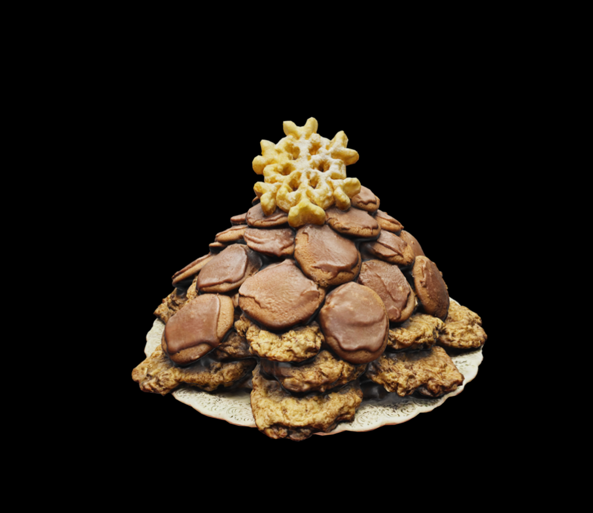

# ASWF USDZ Bake Off

The ASWF USD Working Groups is the Academy's community around Pixar's OpenUSD technology.

USD (https://github.com/PixarAnimationStudios/OpenUSD) is a high-performance extensible software platform for collaboratively constructing animated 3D scenes at a large scale, designed for film and visual effects production, but adopted by many other industries from manufacturing to architecture to digital twins.

This repository hosts community entries to the ASWF USDZ Bake Off, hosted by the ASWF USD Working Group.

## 2025

On January 15 the ASWF USD Working Group enjoyed the results of the 2025 USDZ Bake Off.
Contestants baked something they loved, scanned their creations, and turned them into USDZ files.
After a spirited presentation, the audience picked their favorite, and baker's apprentice and choice were also awarded. 

| File | Author | Screenshot |
| ---- | ------ | ---------- |
| [ApplePie.usdz](2025/ApplePie.usdz) | Alexander Schwank |  |
| [BananaChocolateChipMuffins.usdz](2025/BananaChocolateChipMuffins.usdz) | Russell Boorman |  |
| [CalamansiCoconutSourBar.usdz](2025/CalamansiCoconutSourBar.usdz) | Ninette Tan |  |
| [ChristmasCookies.usdz](2025/ChristmasCookies.usdz) | Russell Boorman   ( :crown: Baker's Choice) |  |
| [ChristmasCookiesSelection.usdz](2025/ChristmasCookiesSelection.usdz) | Lori Smallwood |  |
| [EstellesFirstGingerbreadHouse.usdz](2025/EstellesFirstGingerbreadHouse.usdz) | Cole Clifford   ( :crown: Community Award) |  |
| [FruitTarts.usdz](2025/FruitTarts.usdz) | Russell Boorman |  |
| [GingerbreadHouse.usdz](2025/GingerbreadHouse.usdz) | Mira Ly Herbst, Binh Minh Herbst, Felix Herbst   ( :crown: Baker's Apprentice) |  |
| [HomemadeMincePies.usdz](2025/HomemadeMincePies.usdz) | Lee Kerley |  |
| [HomemadeSausageRolls.usdz](2025/HomemadeSausageRolls.usdz) | Lee Kerley |  |
| [Lussekatter.usdz](2025/Lussekatter.usdz) | Johan Bowald |  |
| [MangoLassiCake.usdz](2025/MangoLassiCake.usdz) | Dhruv Govil |  |
| [PumpkinPie.usdz](2025/PumpkinPie.usdz) | Andrew Beers |  |

ASWF blog post announcing the event: https://www.aswf.io/blog/usdzbakeoff_2025/

